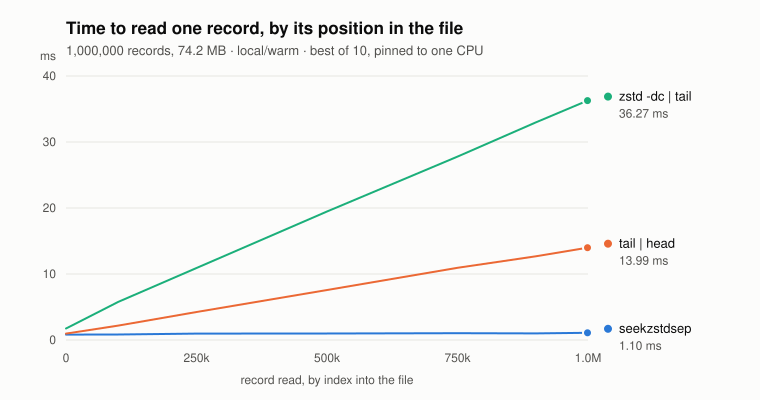

# seekzstdsep

**Reads any record out of a compressed file without decompressing what comes before it.**

| branch | nushell | tag |
| --- | --- | --- |
| `master` | 0.115 | `nu_v.0.115` |
| `0.114/nu` | 0.114 | `nu_v.0.114` |

JSONL, CSV, TSV, logfmt — anything whose records are delimited by a fixed string. It ships as a
command line tool and as a Rust library.

The output is not a proprietary container. It is an ordinary [Zstandard Seekable Format][spec] file,
built by choosing where the frames are cut, so `zstd -d` still restores the original bytes.

Same idea as [BGZF][bgzf] + [tabix][tabix], minus the index file. The frame layout *is* the index,
so there is no sidecar to keep alongside the data or to lose.



Reading one record out of a 1,000,000-record JSONL file (74.2 MB), best of ten, pinned to one CPU:

| record read | `seekzstdsep cat` | `tail \| head` | `zstd -dc \| tail \| head` |
| ---: | ---: | ---: | ---: |
| 0 | 0.82 ms | 0.97 ms | 1.75 ms |
| 500,000 | 0.99 ms | 7.58 ms | 19.46 ms |
| 999,000 | 1.10 ms | 13.99 ms | 36.27 ms |

The two baselines pay for the position; `seekzstdsep` does not. Every frame holds the same number of
separators, so a record index becomes a frame index by division and only that one frame is
decompressed. The full matrix, and the conditions it was taken under, are in `docs/bench/`.

## Install

Rust 1.85 or later (edition 2024) and a C compiler — `zstd-sys` builds a bundled libzstd 1.5.7 from
source, so no system libzstd and no `pkg-config` are needed.

```sh
cargo install --path .
```

## Use it

```sh
seekzstdsep compress events.jsonl                            # -> events.jsonl.seek.zst
seekzstdsep cat events.jsonl.seek.zst --from 10000 --cnt 3   # 0-based record index
seekzstdsep inspect events.jsonl.seek.zst                    # per-frame extents and record counts
```

`truncate` cuts a file back to a frame boundary in place, re-encoding nothing. `append` adds
records in place, re-encoding only the frame the edit lands in — or nothing at all, where `append
--input-seekable` joins another seekable file. `copy-range` writes a record range out to a second
file by copying the frames as they are.
`docs/cli.md` covers every subcommand and flag.

As a library, compression works over any `Read`/`Write` pair:

```rust
use seekzstdsep::convert_to_seekable_zst_reader;

let input: &[u8] = b"record 1\nrecord 2\nrecord 3\n";
let mut compressed: Vec<u8> = Vec::new();

convert_to_seekable_zst_reader(
    input,
    &mut compressed,
    64 * 1024, // frame size target in bytes
    true,      // hold the separator count uniform across frames
    b"\n",
    None,      // limit_multiplier, defaults to 4
)
.unwrap();

assert!(!compressed.is_empty());
```

That fourth argument is the whole point: with `false`, frames are cut by size alone and `cat` can no
longer resolve a record index by arithmetic.

## nushell plugin

`nu_plugin_zstdsep/` reads the same files from nushell, keeping the file open as a value:

```text
> let h = zstdsep open events.jsonl.seek.zst
> $h.1999999.msg
```

380 µs on a 2,000,000-record file, against 4.9 s to read all of it. `nu/install.nu` links a hook
into nushell's autoload directory so that `open` and `save` route `.seek.zst` paths to the plugin on
their own. See `nu_plugin_zstdsep/README.md`.

## Documentation

- `docs/format.md` — what the file is, and the invariant that makes lookup arithmetic
- `docs/cli.md` — every subcommand and flag
- `docs/library.md` — the rest of the API: reading, `truncate`, `append`, `copy_range`, options
- `docs/benchmark.md` — what the benchmarks measure, and the traps they avoid
- `docs/bench/` — the measurements themselves
- `docs/bugs.md` — known issues, including the current `--cnt` semantics

## License

MIT ([LICENSE](./LICENSE)).

[spec]: https://github.com/rorosen/zeekstd/blob/main/seekable_format.md
[bgzf]: https://www.htslib.org/doc/bgzip.html
[tabix]: https://www.htslib.org/doc/tabix.html
